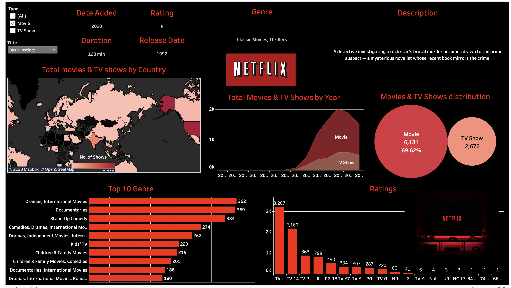

# Netflix Data Analysis with Tableau
The data used in this project was obtained from Kaggle. The Netflix Movies and TV Shows dataset on Kaggle provides information about the titles available on Netflix as of 2021. The data includes various features such as the show/movie title, director, cast, ratings, and release year, among others.

This project aims to provide an in-depth analysis of Netflix's movies and TV shows data using Tableau. The following insights are covered in this project:

1. Top 10 Genres in a Horizontal Bar Chart
2. Ratings Distribution in a Vertical Bar Chart
3. Movies and Shows Distribution using a Packed Bubble Chart
4. Total Movies and TV Shows by Year using an Area Chart
5. Total Movies and TV Shows by Country using a Map
6. Other Movie Specific Details

## Overview

## Acknowledgments
Data source: Kaggle
